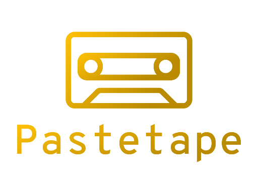

<p align="center">
    
    <p align="center">Pastebin archive scraper with web interface for searching through pastes.</p>
</p>

<p align="center">
    <a href="#requirements">Requirements</a> •
  	<a href="#installation">Usage</a> •
  	<a href="#license">License</a>
</p>

## Requirements
* Python 3

### Python dependencies
* Flask
* Beautiful Soup 4
* requests
* requests[socks]

```bash
$ pip install -r requirements.txt
```

## Usage
In order to use TOR with Pastetape, ensure that the TOR service is working at port 9050.

```bash
$ python pastetape.py -h

usage: pastetape.py [-h] [-s] [-t] [--cf-clearance CF_CLEARANCE] [-i]    
                    [--db DB] [--port PORT] [--debug]
```

## License

Copyright (c) 2020 by ***Kamil Marut***

`Pastetape` is under the terms of the [MIT License](https://www.tldrlegal.com/l/mit), following all clarifications stated in the [license file](LICENSE).
